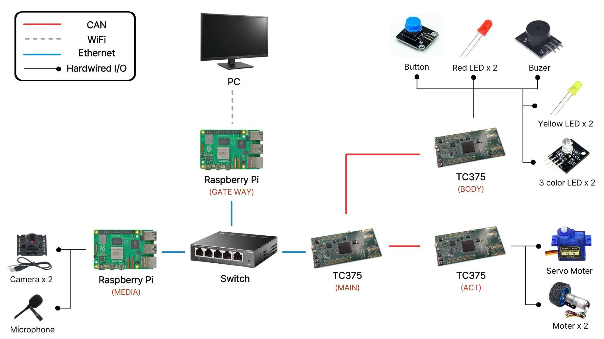

# ReV-CaRS (Remote Vehicle Call & Return System)

### 원격 차량 호출 및 회수 제어 시스템

관제 PC에서 차량을 원격으로 호출·조종·회수하고 
차량 상태, 진단 결과, 사고 이력을 통합 관리하는 차량용 통신 제어 PoC 프로젝트

  
  
  

  
  
  
  

  
  
  
  

---

## Contributors

<table>
  <tr>
    <td align="center">
      <a href="https://github.com/Gon0304">
        
         
        <b>김태곤</b>
      </a>
       
      ACT
    </td>
    <td align="center">
      <a href="https://github.com/kookjd7759">
        
         
        <b>국동균</b>
      </a>
       
      PC / MEDIA
    </td>
    <td align="center">
      <a href="https://github.com/LSA31">
        
         
        <b>이승아</b>
      </a>
       
      MAIN
    </td>
    <td align="center">
      <a href="https://github.com/cenway">
        
         
        <b>윤한준</b>
      </a>
       
      BODY
    </td>
    <td align="center">
      <a href="https://github.com/chohabin">
        
         
        <b>조하빈</b>
      </a>
       
      MAIN
    </td>
  </tr>
</table>

## 산출물 (Deliverables)

  
  
  

- 문서 산출물 위치: [docs/](./docs/)
- 테스트 산출물: 단위 테스트, 통합 테스트, 시스템 테스트, 인수 테스트 HTML 포함

| Sheet | 문서 | 유형 | 바로가기 |
| --- | --- | --- | --- |
| S-01 | 시스템 개념 정의서 | Concept | [Open](<docs/1. 시스템 개념 정의서.html>) |
| S-02 | 유저 요구사항 | Requirements | [Open](<docs/2. 유저 요구사항.html>) |
| S-03 | 기능 요구사항 | Requirements | [Open](<docs/3. 기능 요구사항.html>) |
| S-04 | 시스템 요구사항 | Requirements | [Open](<docs/4. 시스템 요구사항.html>) |
| S-05 | 인터페이스 | Interface | [Open](<docs/5. 인터페이스.html>) |
| S-06 | Pin Map | HW Mapping | [Open](<docs/6. PinMap.html>) |
| S-07 | 단위 테스트 | Test | [Open](<docs/7. 단위 테스트.html>) |
| S-08 | 통합 테스트 | Test | [Open](<docs/8. 통합 테스트.html>) |
| S-09 | 시스템 테스트 | Test | [Open](<docs/9.시스템 테스트.html>) |
| S-10 | 인수 테스트 | Test | [Open](<docs/10. 인수 테스트.html>) |

## 1. 프로젝트 소개

> ReV-CaRS는 **관제 PC의 원격 제어 명령을 Ethernet 기반으로 MAIN Gateway에 전달하고, MAIN ECU가 이를 CAN/CAN FD 제어 프레임으로 변환해 ACT/BODY ECU를 제어하는 시스템**입니다. 
> RC카를 차량 제어 대상으로 삼아 원격 호출, 원격 조종, 회수, 진단, 사고 이력 조회까지 하나의 흐름으로 검증했습니다.

<table>
  <tr>
    <td>
      특히 다음과 같은 상황을 대상으로 합니다.
        
      - 사용자가 직접 차량 위치까지 이동해야 하는 카셰어링 운영 상황 
      - 관제 PC의 제어 명령을 차량 내부 ECU 네트워크로 안전하게 전달해야 하는 상황 
      - 차량의 구동, 조향, 제동, 등화, 경고 기능을 원격으로 통합 제어해야 하는 상황 
      - UDS/DoIP 기반 진단과 DTC 조회가 필요한 상황 
      - 사고 이벤트 발생 시 전후방 영상과 이벤트 이력을 조회해야 하는 상황
    </td>
  </tr>
</table>

## 2. 프로젝트 목표

- 원격 차량 호출 및 회수 서비스 흐름을 RC카 기반 PoC로 구현
- PC 제어 입력을 Ethernet UDP 제어 패킷으로 변환하고 MAIN ECU에 전달
- MAIN ECU에서 제어 패킷을 ACT/BODY용 CAN 제어 프레임으로 라우팅
- ACT ECU의 구동 모터, 브레이크, 서보 조향, 엔코더 속도 피드백 구현
- BODY ECU의 전조등, 방향지시등, 비상등, 경적, 초음파 경고, 충돌 이벤트 처리 구현
- MEDIA Pi의 전후방 녹화, 사고 이력 저장, 영상 스트리밍, SOME/IP 서비스 구현
- UDS/DoIP 기반 DID, DTC, Routine Control 진단 흐름 구현
- 통신 단절, 비정상 입력, 충돌 이벤트에 대한 Fail-safe 동작 검증

## 3. 주요 기능

| 구분 | 내용 |
| --- | --- |
| **3-1. 관제 PC 원격 제어** | **차량 리스트 화면**: 차량 상태와 원격 제어 가능 여부 표시 **원격 조종 화면**: 키보드 기반 전진, 후진, 좌우 조향, 브레이크, 기어 변경 제어 **사전 진단 화면**: 원격 주행 전 MAIN/ACT/BODY/MEDIA 상태 확인 **사고 이력 화면**: MEDIA Pi에 저장된 사고 이벤트와 전후방 영상 조회 |
| **3-2. MAIN Gateway 제어** | **Ethernet UDP 수신**: PC 제어 패킷을 MAIN ECU에서 수신 **PDU / Frame Routing**: 제어 데이터를 ACT/BODY 목적지에 맞게 분리 **CAN 제어 송신**: ACT 제어 프레임 `0x100`, BODY 제어 프레임 `0x110` 송신 **DoIP / UDS 중계**: PC 진단 요청을 MAIN 자체 및 하위 ECU 진단 흐름으로 연결 |
| **3-3. ACT ECU 구동 제어** | **CAN 명령 수신**: MAIN에서 전달한 구동, 조향, 제동, 기어, 모드 명령 처리 **모터 / 브레이크 / 서보 제어**: 주행 방향과 조향 입력에 따라 RC카 구동부 제어 **엔코더 속도 피드백**: Yellow A상 edge 기반 pulse/sec, RPM, km/h 상태 산출 **상태 송신 및 진단**: 속도, 기어, 조향 상태를 MAIN으로 송신하고 UDS Routine/DTC 지원 |
| **3-4. BODY ECU 차체 제어** | **등화 제어**: 전조등, 브레이크등, 방향지시등, 비상등 출력 **경고 출력**: 부저와 경고등을 통한 경적, 충돌 경고, 초음파 거리 경고 처리 **충돌 이벤트 송신**: 충돌 버튼 입력을 MAIN/PC 이벤트로 전달 **BODY 진단**: 초음파 거리 DID, 등화/충돌 상태 DID, DTC 및 Routine Control 지원 |
| **3-5. MEDIA Pi 블랙박스** | **전후방 카메라 녹화**: USB 카메라 기반 연속 녹화 및 이벤트 영상 저장 **마이크 녹음**: 사고 전후 오디오 데이터 저장 **Flask 스트리밍**: 실시간 영상과 이벤트 영상 제공 **SOME/IP 서비스**: 사고 이력 목록과 경고등 제어 서비스를 PC에 제공 **DoIP 자체 진단**: 카메라, 마이크, 저장공간, Flask, SOME/IP, eth0 상태 DID/DTC 제공 |

## 프로젝트 시연

### 모듈 별 기능

  <table>
    <tr>
      <td align="center" width="50%">
        
      </td>
      <td align="center" width="50%">
        
      </td>
    </tr>
    <tr>
      <td align="center" width="50%">
        
      </td>
      <td align="center" width="50%">
        
      </td>
    </tr>
    <tr>
      <td align="center" width="50%">
        
      </td>
      <td align="center" width="50%">
        
      </td>
    </tr>
    <tr>
      <td align="center" width="50%">
        
      </td>
      <td align="center" width="50%">
        
      </td>
    </tr>
    <tr>
      <td align="center" width="50%">
        
      </td>
      <td align="center" width="50%">
        
      </td>
    </tr>
    <tr>
      <td align="center" width="50%">
        
      </td>
      <td align="center" width="50%">
        
      </td>
    </tr>
    <tr>
      <td align="center" width="50%">
        
      </td>
      <td align="center" width="50%">
        
      </td>
    </tr>
  </table>

### 시연 영상

---

---

### 시스템 아키텍처

> 관제 PC, MAIN Gateway, ACT ECU, BODY ECU, MEDIA Pi가 Ethernet, CAN, SOME/IP, DoIP로 연결되는 전체 구조입니다.

  

## 4. 시스템 구성

본 시스템은 5개의 주요 파트로 구성됩니다.

- **PC Control Center** - React 기반 관제 UI, Flask 제어 백엔드, 진단/사고 이력 조회 클라이언트
- **MAIN / Gateway ECU (TC375)** - Ethernet 수신, SoAd/SD/DoIP 처리, PDU 라우팅, CAN 제어 송신
- **ACT ECU (TC375)** - 구동 모터, 브레이크, 서보 조향, 엔코더 속도 피드백, ACT 진단
- **BODY ECU (TC375)** - 등화, 경적, 초음파 경고, 충돌 이벤트, BODY 진단
- **MEDIA Pi (Raspberry Pi 4)** - 전후방 카메라, 마이크, 블랙박스 저장, Flask 스트리밍, SOME/IP, DoIP 진단

### 네트워크 아키텍처

| 구간 | 통신 방식 | 주요 데이터 |
| --- | --- | --- |
| PC ↔ MAIN ECU | Ethernet UDP / TCP | 원격 제어 명령, 차량 상태 피드백, 이벤트 수신, DoIP 진단 |
| MAIN ECU ↔ ACT ECU | CAN / CAN FD | 구동·조향·제동 명령, 속도/기어/조향 상태, ACT UDS 응답 |
| MAIN ECU ↔ BODY ECU | CAN / CAN FD | 등화·경적·경고 명령, 충돌 이벤트, BODY UDS 응답 |
| PC ↔ MEDIA Pi | Ethernet / SOME/IP / DoIP | 사고 영상 목록, 경고등 서비스, 미디어 장치 진단 |
| MEDIA Pi 내부 | Flask / SQLite / Recorder | 영상 저장, 이벤트 DB, 실시간 스트리밍 |

## 5. 개발 포인트

- **차량용 통신 흐름 구현**: Ethernet, UDP, TCP, CAN, SOME/IP, DoIP를 하나의 원격 제어 시나리오 안에서 연동
- **AUTOSAR 유사 계층 설계**: SoAd, SD, DoIP, CanTp, CanIf, PduR, COM, DCM 형태로 MAIN Gateway 역할 분리
- **20ms 제어 루프**: PC 제어 패킷과 MAIN의 ACT/BODY 제어 프레임 송신 주기를 기준으로 실시간 제어 흐름 구성
- **ACT 속도 피드백 개선**: 엔코더 edge를 100ms window로 집계하여 pulse/sec, RPM, km/h 상태를 산출하고 CAN 상태 프레임으로 송신
- **진단 기능 통합**: MAIN/ACT/BODY/MEDIA에 DID, DTC, Routine Control을 구성하고 PC UI에서 조회/실행 가능하도록 연결
- **블랙박스 서비스 통합**: MEDIA Pi의 전후방 영상, 마이크, 이벤트 DB를 사고 이력 조회 UI와 SOME/IP 서비스로 연동
- **Fail-safe 설계**: 통신 timeout, 비정상 명령, 충돌 이벤트, 장치 오류에 대해 안전 정지와 오류 표시가 가능하도록 설계
- **요구사항 추적성 확보**: 사용자 요구사항 60개, 기능 요구사항 103개, 시스템 요구사항 60개와 테스트 산출물을 연결

## 6. 테스트 결과

| **총 테스트 수** | **Pass** | **Fail** | **N/A** |
| --- | --- | --- | --- |
| **424** | **391** | **31** | **2** |

| 테스트 구분 | 총 테스트 수 | Pass | Fail | N/A | 산출물 |
| --- | ---: | ---: | ---: | ---: | --- |
| 단위 테스트 | 253 | 239 | 13 | 1 | [Open](<docs/7. 단위 테스트.html>) |
| 통합 테스트 | 73 | 61 | 12 | 0 | [Open](<docs/8. 통합 테스트.html>) |
| 시스템 테스트 | 58 | 51 | 6 | 1 | [Open](<docs/9.시스템 테스트.html>) |
| 인수 테스트 | 40 | 40 | 0 | 0 | [Open](<docs/10. 인수 테스트.html>) |

단위 테스트, 통합 테스트, 시스템 테스트, 인수 테스트까지 수행하며 PC → MAIN → ACT/BODY → MEDIA로 이어지는 전체 원격 차량 제어 흐름을 검증했습니다.

## 7. 담당 역할

  

<table>
  <tr>
    <td width="50%" valign="top">
      <strong>김태곤</strong>  
      - 파트: <strong>ACT ECU</strong> 
      - 담당: <strong>차량 구동 및 제동 실행부</strong> 
      - 주요 기능: CAN 제어 명령 수신, DC 모터 제어, 브레이크 처리, 서보 조향, 엔코더 기반 속도 피드백, ACT UDS 진단 
      - 비고: MAIN Gateway에서 전달된 제어 명령을 실제 RC카 동작으로 변환하고, 속도와 조향 상태를 다시 시스템에 피드백하는 실행 계층 구현
    </td>
    <td width="50%" valign="top">
      <strong>국동균</strong>  
      - 파트: <strong>PC Control Center / MEDIA Pi</strong> 
      - 담당: <strong>관제 UI, 제어 백엔드, 미디어/블랙박스 연동</strong> 
      - 주요 기능: React 관제 화면, Flask 제어 API, UDP 제어 송신, 속도/이벤트 수신, 사고 이력 조회, SOME/IP 클라이언트, MEDIA Pi 녹화/스트리밍/진단 연동 
      - 비고: 사용자가 차량 상태 확인, 사전 진단, 원격 조종, 사고 이력 조회를 하나의 화면 흐름에서 수행할 수 있도록 PC-MEDIA 흐름 구현
    </td>
  </tr>
  <tr>
    <td width="50%" valign="top">
      <strong>이승아, 조하빈</strong>  
      - 파트: <strong>MAIN / Gateway ECU</strong> 
      - 담당: <strong>차량 네트워크 게이트웨이 및 제어 라우팅</strong> 
      - 주요 기능: Ethernet 수신, LwIP 기반 UDP/TCP 처리, SoAd/SD/DoIP, PduR/COM 라우팅, ACT/BODY CAN 제어 송신, MAIN 진단 및 통신 DTC 처리 
      - 비고: PC 제어 명령을 차량 내부 네트워크로 변환하고, 하위 ECU 진단과 상태 피드백이 오갈 수 있는 중앙 게이트웨이 구조 구현
    </td>
    <td width="50%" valign="top">
      <strong>윤한준</strong>  
      - 파트: <strong>BODY ECU</strong> 
      - 담당: <strong>차체 전장 및 경고 출력</strong> 
      - 주요 기능: 전조등, 방향지시등, 비상등, 브레이크등, 부저, 초음파 경고, 충돌 이벤트, BODY UDS 진단 
      - 비고: 원격 주행 중 사용자와 주변 환경에 차량 상태를 알리는 표시/경고 계층을 담당하고, 충돌 이벤트를 시스템 이벤트로 연결
    </td>
  </tr>
</table>

## 8. 기술 스택

| Hardware | Embedded / Network | PC / Media | Tools |
| --- | --- | --- | --- |
| Infineon **TC375** **Raspberry Pi 4** RC Car DC Motor, Servo Motor, Encoder LED, Buzzer, Ultrasonic Sensor USB Camera, Microphone | **C** CAN / CAN FD Ethernet / UDP / TCP LwIP UDS / DoIP SOME/IP-like Service PDU / Frame Routing | **Python 3** **Flask** **React / Vite** **SQLite** someipy doipclient / udsoncan OpenCV / ffmpeg | **AURIX Development Studio** **VS Code** **GitHub** **Wireshark** **PCAN-View** |

## 9. 프로젝트 의의

ReV-CaRS는 단순 RC카 조종이 아니라, 
**관제 입력 → Ethernet 제어 패킷 → MAIN Gateway → CAN 제어 프레임 → ACT/BODY 동작 → 상태·진단·사고 이력 피드백**까지 이어지는 차량용 통신 제어 흐름을 구현한 프로젝트입니다.

특히 원격 차량 호출·회수 서비스 시나리오 안에서 ECU 제어, 차량 네트워크, 진단, 블랙박스, 사고 이력, Fail-safe를 하나의 시스템으로 연결해 보았다는 점에서 의미가 있습니다.

## 10. 아쉬웠던 점 및 개선 방향

- 원격 제어 패킷 인증 및 HMAC 검증 로직 고도화 필요
- 통신 지연, 패킷 손실, CAN bus-off 상황에 대한 정량 테스트 보완 필요
- 일부 Fail 항목에 대한 실차 조건 재검증 및 보완 필요
- 영상 스트리밍 품질과 카메라 장치 예외 처리 개선 필요
- 진단 결과와 DTC 로그의 필터링, 검색, 장기 저장 기능 고도화 필요
- 실제 차량 환경을 고려한 제동 우선순위와 안전 정책 보완 필요

### 10-1. 저장소 구조

| 디렉터리 | 설명 |
| --- | --- |
| **PC/** | React 관제 화면과 Flask 기반 PC 제어 백엔드가 포함되어 있습니다. 차량 리스트, 사전 진단, 원격 조종, 사고 이력 화면과 UDP 제어 송신, 속도/이벤트 수신, SOME/IP/DoIP 클라이언트 코드가 포함됩니다. |
| **MAIN/** | TC375 기반 MAIN/Gateway ECU 프로젝트입니다. Ethernet 수신, LwIP, UDP/TCP, SoAd, SD, DoIP, CanTp, CanIf, PduR, COM, DCM, CAN 라우팅 및 상태 피드백 로직이 포함됩니다. |
| **ACT/** | TC375 기반 ACT ECU 프로젝트입니다. MAIN에서 받은 CAN 제어명령을 바탕으로 구동 모터, 브레이크, 서보 조향을 제어하고 엔코더 기반 속도와 진단 응답을 송신합니다. `test_act_forward_speed.py`를 통해 ACT 전진 속도 피드백을 확인할 수 있습니다. |
| **BODY/** | TC375 기반 BODY ECU 프로젝트입니다. 전조등, 방향지시등, 브레이크등, 비상등, 부저, 초음파 경고, 충돌 이벤트, 램프 진단 기능을 담당합니다. |
| **MEDIA/** | Raspberry Pi 기반 미디어/블랙박스 파트입니다. 전후방 카메라, 마이크, 이벤트 녹화, SQLite 이벤트 DB, Flask 스트리밍, SOME/IP 사고 이력 서비스, DoIP 자체 진단 게이트웨이가 포함됩니다. |
| **GATEWAY/** | Gateway 관련 정리 공간입니다. |
| **docs/** | 시스템 개념 정의서, 유저 요구사항, 기능 요구사항, 시스템 요구사항, 인터페이스, Pin Map, 단위/통합/시스템/인수 테스트 HTML 산출물이 포함됩니다. |
